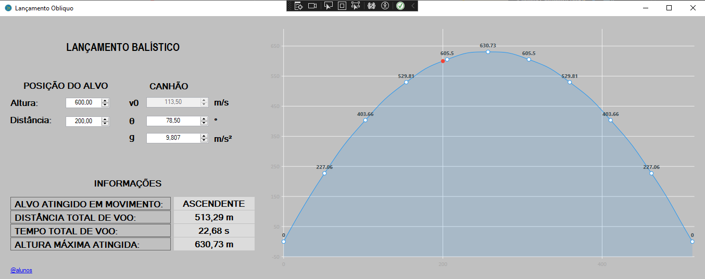

# CALCULADORA DE TRAJETÓRIA BALÍSTICA

Este projeto foi proposto pela Faculdade Engenheiro Salvador Arena (FESA) no curso de Engenharia de Computação  

## Projeto interdisciplinar de Física Geral e Experimental I e Algoritmos II

## Problema a resolver

>Considere o canhão apresentado na figura a seguir, inclinado de um ângulo θ em relação à horizontal. Ele
dispara um projétil com velocidade inicial de módulo v0, com o objetivo de acertar um alvo estacionário
situado em P, sendo conhecidos os valores da distância horizontal x (entre o ponto de lançamento e a vertical
do alvo) e a altura H do alvo em relação ao solo (horizontal).
> **A resistência do ar é desprezível e a aceleração gravitacional local tem intensidade g = 9,8 m/s².**

 

 

### ***Com base nessas informações, o programa a ser desenvolvido deve:***

- a) Retornar ao usuário o valor que θ deve superar para que o objetivo seja cumprido.

- b) Solicitar ao usuário que entre com um valor válido para θ.

- c) Fornecer o(s) valor(es) da velocidade inicial do lançamento, v0, para que o objetivo seja cumprido.

- d) Encontrar o intervalo de tempo gasto desde o lançamento do projétil até atingir o alvo.

- e) Informar se o alvo é atingido quando o projétil está em movimento ascendente ou descendente.

- f) Fornecer um gráfico da trajetória do projétil, isto é: coordenada vertical (y) em função da coordenada
horizontal (x).

 

